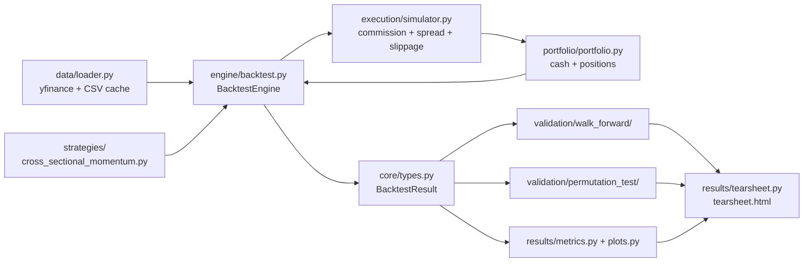

# Strategy Backtester

A cross-sectional momentum backtesting framework for U.S. equities, built to test
whether a textbook momentum signal survives realistic transaction costs and
proper out-of-sample validation — not just to produce a nice equity curve.


## Overview

Most backtests report a single equity curve and call it a day. This project is
built around the opposite instinct: the backtest engine, cost model, and
strategy logic are one part of the codebase — the other, equally-sized part is
a **validation suite** (walk-forward testing and permutation testing) designed
specifically to catch overfitting and distinguish genuine signal from noise.

The strategy under test is a classic 12-1 month cross-sectional momentum
factor on a subset of the S&P 500 (2018–2025). The headline result is a
**negative one**: after realistic transaction costs, the strategy does not
show a positive Sharpe ratio, and out-of-sample validation shows the
in-sample parameter selection does not generalize. The rest of this README
walks through how that conclusion was reached and why it's trustworthy.

## Key Results

### Primary Backtest

Config: `lookback=252, skip=21, percent=0.1, rebalance_freq=21` — a standard
12-1 momentum parameterization, chosen independently of the walk-forward
grid search (see [Methodology](#methodology) for why).

| Metric | Value |
|---|---|
| Final portfolio value | $899,124 (from $1,000,000) |
| Cumulative return | -10.09% |
| Annualised return (EAR) | -1.32% |
| Sharpe ratio | -0.34 |
| Max drawdown | 35.2% (over 1,595 trading days) |
| Win rate | 46.94% |
| Return skew | -1.60 |
| Excess kurtosis | 16.68 |
| Total transaction costs | $57,853 |
| Avg cost per rebalance | $688 |

The strategy loses money before considering whether the signal is genuine at
all — negative skew and fat tails on top of a negative Sharpe is a
particularly weak combination.

### Walk-Forward Validation

Expanding-window walk-forward over a grid of `lookback`, `skip`, `percent`,
and `rebalance_freq` values, selecting the best in-sample Sharpe per fold and
evaluating it out-of-sample.

| Fold | OOS Sharpe |
|---|---|
| 1 | +0.37 |
| 2 | -1.64 |
| 3 | -0.15 |
| 4 | -0.92 |
| 5 | -0.90 |

Mean OOS Sharpe: **-0.647** (std 0.694), only 1 of 5 folds positive. Fold 1's
positive result coincides with a thin in-sample window and a lucky 2020 OOS
period rather than a robust signal — it doesn't hold up in folds 2–5. The
consistent in-sample-positive / out-of-sample-negative pattern across later
folds is the signature of parameter overfitting, not genuine predictive
power: the grid search finds parameters that worked on the in-sample window
by chance, and they fail to generalize.

### Permutation Test

> **Note for reviewers:** the numbers below are from a diagnostic run and
> need to be regenerated against the current cost model before this section
> is finalized — flagging this explicitly rather than publishing stale
> figures. See [Future Work](#future-work).

The permutation test (rank-shuffle scheme — see
[Methodology](#methodology)) initially returned a p-value of 0.0, which on
its face looks like strong evidence of signal. It isn't. Diagnostics showed
the null portfolios carry roughly 5x lower volatility than the real momentum
portfolio, because randomly reassigning signal values across tickers
produces a near-market-neutral book from a highly correlated universe, while
the real momentum ranking deliberately selects divergent extreme-return
stocks. **The Sharpe gap is a volatility-structure artifact, not evidence of
signal quality** — comparing Sharpe ratios across portfolios with
structurally different volatility isn't a valid test in this setup. This is
reported here as a methodology finding in its own right: a naive read of the
p-value would have been a false positive on signal strength.

## Methodology

### Strategy: Cross-Sectional Momentum (12-1)

At each rebalance date, ranks all tickers in the universe by their trailing
return from 252 trading days ago to 21 trading days ago (the most recent
month is excluded to avoid short-term reversal contamination — a standard
adjustment in the momentum literature). Goes long the top decile and short
the bottom decile, equal-weighted within each leg.

### Execution & Cost Model

Trades are costed with three components, computed per rebalance and
deducted directly from portfolio cash:
- **Commission**: flat basis-points fee on traded notional.
- **Spread**: flat basis-points cost on traded notional.
- **Slippage**: proportional to each order's participation rate against
  20-day average daily volume — larger orders relative to liquidity cost
  more, which is what makes the decile-based long/short legs meaningfully
  more expensive to trade than a small position would be.

### Validation Framework

Two independent checks, both because a single backtest result — positive or
negative — proves very little on its own:

- **Walk-forward validation**: expanding-window in-sample parameter search,
  out-of-sample evaluation, repeated across folds. Tests whether the
  strategy's parameters generalize rather than being curve-fit.
- **Permutation testing**: three interchangeable null-hypothesis schemes are
  implemented —
  - `ranks`: shuffles which ticker gets which signal value, preserving the
    cross-sectional distribution of the signal but destroying its
    assignment to specific stocks (the active scheme in `config.yaml`).
  - `iid`: shuffles each ticker's daily returns independently over time,
    testing whether performance depends on time-series ordering.
  - `block`: shuffles contiguous blocks of each ticker's returns, testing
    whether performance depends on longer-horizon structure versus
    short-run dependence.

  Each produces a distribution of "what would performance look like if the
  signal carried no information," against which the real backtest is
  compared.

### Design Decision: Parameter Selection

The primary backtest reported above uses the original config parameters,
**not** the walk-forward grid search's selected parameters. Using the
walk-forward-selected parameters for headline results would be in-sample
selection dressed up as out-of-sample — the walk-forward results are
presented separately, specifically to show how much the in-sample and
out-of-sample performance diverge under a proper search.

## Architecture



```
strategy_backtester/
├── core/            # Shared dataclasses (BacktestResult, PermutationResult, ...)
├── data/            # yfinance fetch + CSV caching, validated PriceDataFrame
├── strategies/       # Strategy interface + cross-sectional momentum implementation
├── execution/        # Fill simulation, commission/spread/slippage cost model
├── portfolio/         # Cash and position accounting
├── engine/            # Orchestrates strategy → execution → portfolio per day
├── validation/
│   ├── walk_forward/       # Expanding/rolling window IS/OOS validation
│   └── permutation_test/   # Rank/IID/block null-hypothesis schemes
├── results/           # Metrics, matplotlib charts, self-contained HTML tearsheet
├── configs/config.yaml
└── main.py            # CLI entry point with per-stage caching
```

## Installation & Usage

```bash
git clone https://github.com/<YOUR_USERNAME>/strategy_backtester.git
cd strategy_backtester
pip install -e .

# Run everything (fetches data, runs backtest + walk-forward + permutation test,
# generates tearsheet.html)
python -m strategy_backtester.main

# Re-run only the backtest, loading permutation/walk-forward results from cache
python -m strategy_backtester.main --skip-perm --skip-wf

# Load everything from cache (no recomputation)
python -m strategy_backtester.main --skip
```

Configuration (universe, date range, strategy parameters, walk-forward grid,
permutation scheme) lives in `strategy_backtester/configs/config.yaml`.

## Testing

```bash
pip install -e ".[dev]"
pytest
```

255 tests covering the data pipeline, execution/cost model, portfolio
accounting, strategy signal generation (including a synthetic-data sanity
check that the momentum strategy actually longs winners and shorts losers),
and both validation schemes. CI runs the suite on Python 3.9–3.12 on every
push and pull request to `main`.

## Future Work

- **Rank correlation analysis**: Spearman correlation between momentum score
  at formation and forward return, aggregated across rebalance dates —
  tests whether the ranking itself has cross-sectional discriminatory power,
  independent of the portfolio-level Sharpe comparisons above.
- **Cost-sensitivity test**: compare in-sample Sharpe across `percent`
  values (leg size) per walk-forward fold, controlling for other
  parameters, to test whether smaller legs are favored primarily because
  they reduce transaction costs rather than because they select a cleaner
  signal.
- **Data validation**: enforce monotonic date ordering in
  `make_price_dataframe`'s validator (currently unvalidated).
- Re-run the permutation test under the current (dollar-denominated) cost
  model and replace the diagnostic figures above with final ones.

## License

MIT — see [LICENSE](LICENSE).